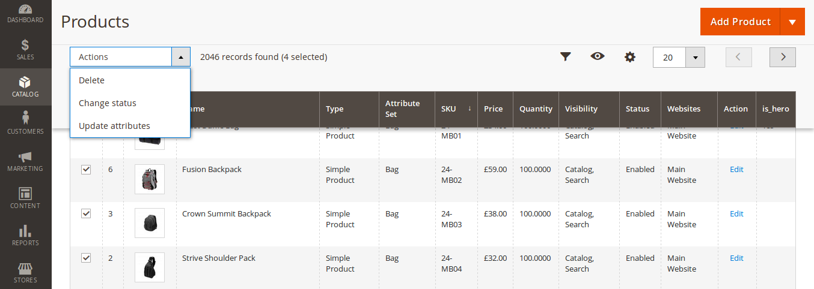
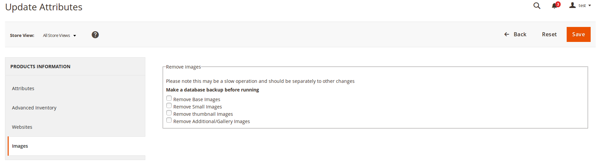

# magento 2 - Add the ability to mass delete images from product's in the product grid.
Note: The images are removed on a global level

## Installation
- composer config repositories.paulmillband-add-products-to-categories-in-admin vcs git@github.com:yorick2/m2-product-grid-remove-images.git
- composer require paulmillband/m2-product-grid-remove-images:dev-master
- composer update 
- php bin/magento module:enable Paulmillband_ProductGridRemoveImages
- php bin/magento setup:upgrade
- php bin/magento setup:di:compile

## Instructions
- login to magento admin
- go to catalog > products 
- select your products 
- select 'update attributes' from the drop down
- select 'Images'

---

---

